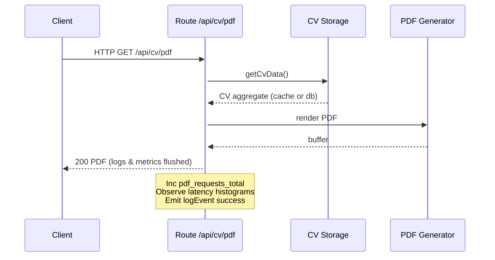

<!-- Source: formerly docs/observability.md -->

## Purpose
Provide end‑to‑end visibility into behavior, performance, reliability and security posture of the application with three pillars:

1. Logging (structured, privacy-aware, correlation friendly)
2. Metrics (Prometheus exposition for real‑time & historical analysis)
3. Tracing (lightweight scaffold today; upgrade path to full distributed tracing later)

> Scope: Single service (Next.js app) running in container / k8s. Multi-service federation is not yet required; design leaves extension points.

---
## Logging
Library: `pino` (fast structured JSON). Pretty printing in non‑production for developer ergonomics.

### Key Features
- Structured events with consistent `event` field (domain or perf namespace, e.g. `domain:cv.json.success`, `perf:rum.stats`).
- Privacy tier via `LOG_PRIVACY` (`low` | `high`). High mode applies URL host redaction and future PII scrubbing extensions.
- Shallow scrubbing of obvious PII (email detection). Redacted kinds listed in `redactions` array for auditability.
- Request correlation using deterministic or synthesized `requestId` (from inbound `x-request-id` header or random UUID).
- Stack deduplication: `logError` emits a short SHA1 `stackHash` to aggregate identical error shapes without persisting full stack traces (defense-in-depth for privacy / size).
- Resilient request context builder tolerates partial / synthetic requests (unit tests call handlers directly).

### Event Taxonomy (Illustrative)
| Prefix | Domain | Example | Notes |
| ------ | ------ | ------- | ----- |
| `domain:` | Feature flows | `domain:admin.skill.upsert_success` | CRUD outcomes |
| `perf:` | Performance endpoints | `perf:rum.stats` | Lightweight RUM stats retrieval |
| `auth:` | Authentication | `auth:login.success` (future) | Currently using `domain:` variants for admin login events |
| `cv:` | CV data pipeline | `domain:cv.json.success` | Source attribution via metrics, logs show result |

### Suggested Log Shipping (Future)
- **Container Stdout** -> Fluent Bit / Vector -> Central store (e.g. Loki / Elasticsearch / OpenSearch).
- Retain JSON (avoid re‑parsing); index on `event`, `requestId`, `stackHash`.

---
## Metrics
Library: `prom-client` with a single Registry exposed at `/api/metrics` (`text/plain; version=0.0.4`). Route is marked `dynamic = 'force-dynamic'` to avoid Next ISR caching.

### Metric Families Implemented
| Metric | Type | Labels | Purpose |
| ------ | ---- | ------ | ------- |
| `pdf_requests_total` | Counter | `result` | Success / error / timeout classification of PDF route |
| `pdf_generation_duration_seconds` | Histogram | `result` | End‑to‑end latency distribution for PDF generation |
| `pdf_cache_entries` | Gauge | – | Current in‑memory / backend cache entry count |
| `pdf_cache_hits_total` / `pdf_cache_misses_total` | Counter | – | Effectiveness of PDF caching layer |
| `pdf_cache_get_duration_seconds` | Histogram | `backend` | Backend cache access latency |
| `permalink_creates_total` | Counter | – | User engagement with permalink feature |
| `cv_aggregate_loads_total` | Counter | `source` (`db|empty|redis`) | Data source provenance for CV aggregates |
| `cv_cache_hits_total` / `cv_cache_misses_total` | Counter | `backend` | CV data caching effectiveness |
| `cv_storage_backend` | Gauge | `backend` | Which backend is active (value=1) |
| `cv_storage_get_duration_seconds` | Histogram | `backend` | Latency of CV storage fetch operations |
| `auth_login_attempts_total` | Counter | `result` | Login success vs failure counts |
| `auth_active_sessions` | Gauge | – | Current live admin sessions |
| `auth_rate_limiter_backend` | Gauge | `backend` | Active rate limiter implementation indicator |
| `auth_login_backoff_ms` | Gauge | – | Last applied exponential backoff delay |
| `auth_rate_limit_failures_total` | Counter | – | Credential failure / limiter trigger counts |
| `cv_entity_mutations_total` | Counter | `entity,action,result` | CRUD throughput + error surface in admin panel |
| (Default metrics) | Gauge / Counter | – | Node runtime and process resource indicators |

> Label Cardinality Control: All labels are low cardinality (controlled vocabularies) to remain Prometheus friendly.

### Sample Scrape (Excerpt)
```
# HELP pdf_requests_total Total PDF generation requests by result
# TYPE pdf_requests_total counter
pdf_requests_total{result="success"} 42
pdf_requests_total{result="timeout"} 3
pdf_requests_total{result="error"} 1
# HELP pdf_generation_duration_seconds End-to-end duration of PDF route handling by result
# TYPE pdf_generation_duration_seconds histogram
pdf_generation_duration_seconds_bucket{result="success",le="0.5"} 15
...
pdf_generation_duration_seconds_sum{result="success"} 8.21
pdf_generation_duration_seconds_count{result="success"} 42
```

### Alerting & SLO Starters (Not yet codified)
- PDF success rate > 99% over 5m; alert if below.
- 95p `pdf_generation_duration_seconds` < 2s.
- CV data load miss ratio (`cv_cache_misses_total / (hits+misses)`) < 30%.
- Auth login failure spike: 5x baseline over 10m (possible brute force / config issue).

### Deployment Notes
- In Kubernetes expose `/api/metrics` via a ServiceMonitor or PodMonitor (Prometheus Operator) with scrape interval 15s–60s.
- Consider adding `X-Prometheus-Scrape: true` response header (optional) for easier debugging.

---
## Tracing (Current State & Roadmap)
Flag: `ENABLE_TRACING=1` enables lightweight spans.

### Phase 2 (Current)
- `startSpan(name, initial)` now generates a UUID `traceId` and logs structured events via the base logger:
	- `trace:start` { traceId, span, ...initial }
	- `trace:end` { traceId, span, durationMs }
- Console debug markers preserved for continuity.
- `withSpan(name, fn)` helper added for concise synchronous instrumentation.

### Limitations
- No child span nesting or context propagation.
- No W3C `traceparent` header (planned Phase 3).

### Upgrade Path
| Phase | Goal | Changes |
| ----- | ---- | ------- |
| 1 | Console visibility | Plain console markers (legacy) |
| 2 (now) | Correlated logs | Structured start/end, durationMs, traceId |
| 3 (scaffold) | OTEL bootstrap | Conditional OTLP exporter init (`src/lib/otel-init.ts`), lazy `ensureTelemetry()` call |
| 4 | Propagation | Inject/extract W3C headers across future services & workers |
| 5 | Sampling | Tail & dynamic sampling for high‑volume spans |

### Correlation Strategy
- Combine `traceId` with existing `requestId` (they may differ; future entry spans can align them).
- Dashboards can group by `traceId` and join to metrics (e.g., high durationMs -> examine histogram buckets).

---
## Correlation & Context Model
| Field | Source | Use |
| ----- | ------ | --- |
| `requestId` | Incoming header or generated UUID | Join logs across request lifecycle |
| `stackHash` | SHA1( stack ) first 8 hex | Error aggregation & dashboard linking |
| `event` | Manual classification | Filtering & dashboards |
| Metrics labels | Code instrumentation | Identify performance or reliability hotspots |

Mermaid request sequence (PDF generation path):


---
## Privacy & Data Handling
- Email addresses redacted (`[redacted.email]`).
- URL hosts redacted in high privacy mode (path retained for debugging). Future: central configurable regex list.
- Errors reduced to `{name,message}` + `stackHash`; full stack avoided in logs by design (can be re‑enabled behind secure flag if needed).

### Data Minimization Principles
1. Log only what’s required for debugging & product metrics.
2. Distinguish between user PII and synthetic/internal fields.
3. Surface redaction evidence (`redactions` array) to validate policies in production.

---
## Local Development & Testing
| Need | Action |
| ---- | ------ |
| View pretty logs | Ensure `NODE_ENV != production` (pretty transport auto enabled) |
| Force high privacy test | `LOG_PRIVACY=high npm test` |
| Dump metrics once | `curl http://localhost:3000/api/metrics` after `npm run dev` |
| Enable tracing scaffold | `ENABLE_TRACING=1 npm run dev` (console.debug spans) |
| Add new metric | Define in `src/lib/metrics.ts`, export, instrument; tests should increment and assert |

### Testing Guidance
- Unit tests assert counters / gauges where meaningful; keep assertions tolerant of preceding default metrics.
- Add histograms only for stable latency classes; avoid high cardinality label additions without design review.

---
## Extensibility / Next Steps
| Priority | Enhancement | Rationale |
| -------- | ---------- | --------- |
| High | OTEL integration (Phase 2) | Rich latency breakdown, parent/child span relationships |
| High | Error budget SLO dashboards | Translate counters to burn alerts |
| Medium | Metrics anomaly detection rules | Early drift detection (cache miss spikes) |
| Medium | Structured tracing -> logging bridge | Single pane correlation before full OTEL |
| Low | Log sampling (debug burst control) | Cost & noise reduction |
| Low | Redaction config file | Centralized policy & dynamic reload |

---
## Change Log (Doc)
- 2025-09-02: Initial full enrichment (logging, metrics catalog, tracing roadmap, diagrams, privacy, roadmap).

### Tooling Note: Phantom ESLint Warnings
During OTEL scaffold work, the editor task view showed persistent `@typescript-eslint/no-explicit-any` warnings in a deleted file (`src/lib/otel.ts`) and arbitrary lines in `tracing.ts` even though direct lint runs were clean. Resolution steps:
1. Renamed bootstrap file to `src/lib/otel-init.ts` and updated imports.
2. Deleted incremental build artifact `tsconfig.tsbuildinfo` to purge stale file references.
3. Added `npm run lint:diag` script executing targeted JSON lint and `--print-config` to verify true rule enforcement.
4. Confirmed CI (`lint:ci`) authoritative output reports zero warnings.
This guards against false-positive gating while retaining strict lint rules.

---
## Quick Reference
Environment variables:
- `LOG_LEVEL` (default `info`)
- `LOG_PRIVACY` (`low`|`high`)
- `ENABLE_TRACING` (`1` to enable scaffold)

Key source files:
- Logging: `src/lib/logger.ts`
- Metrics: `src/lib/metrics.ts`, exposition: `src/app/api/metrics/route.ts`
- Tracing scaffold: `src/lib/tracing.ts`

See also:
- `docs/architecture/architecture.md` (system overview)
- `docs/operations/operations.md` (runtime & operational procedures)
- `docs/engineering/ci-cd.md` (pipeline & quality gates)

